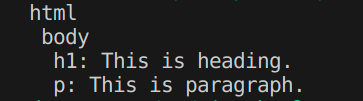

# Tiny HTML Parser in c++

A minimal educational HTML parser written in C++ that builds a DOM-like tree and prints nested HTML tags with their text content.

## Overview
This project is designed for learning how parsing and tree construction work in C++.
It focuses on building a foundational understanding of
- String parsing
- Recursion
- Tree data structure
- Object-oriented programming concepts. 

## Features
   - Builds a tree of nodes representing HTML elements
   - Stores tag name, text content, and child nodes
   - Recursive printing of HTML structure

## Planned Features
   - Attribute parsing to capture tag details (e.g., `class`, `id`)
   - Support for self-closing tags
   - Graceful handling of malformed HTML
   - Modern memory management using `unique_ptr`

### Sample HTML Input
```html
<html>
  <body>
    <h1>This is heading.</h1>
    <p>This is paragraph.</p>
  </body>
</html>
```

### Parser Output
html
 body
  h1: This is heading.
  p: This is paragraph.

### Parser Output (Screenshot)


